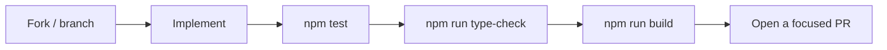

# Contributing to GitWrapped

Thank you for helping. Small, careful changes beat large, rushed ones.

Before you write code, check:

- Does this improve the story experience?
- Does it stay maintainable?
- Does it match the design philosophy?
- Is it simple enough?

---

## How a contribution should flow



---

## Local setup

```bash
git clone https://github.com/isthatpratham/GitWrapped.git
cd GitWrapped
npm install
cp .env.example .env.local
npm run dev
```

Add `GITHUB_TOKEN` to `.env.local` only. Do not commit secrets, tokens, or `.env` files.

---

## Architecture rules

Keep the pipeline intact:

```text
GitHub → validated data → analytics → Story Intelligence → Story Player
```

Layer details: [docs/ARCHITECTURE.md](docs/ARCHITECTURE.md), [docs/DATA_CONTRACTS.md](docs/DATA_CONTRACTS.md), [docs/GITHUB_SDK.md](docs/GITHUB_SDK.md), [docs/ANALYTICS.md](docs/ANALYTICS.md), [docs/STORY_INTELLIGENCE.md](docs/STORY_INTELLIGENCE.md), [docs/STORY_PLAYER.md](docs/STORY_PLAYER.md).

| Layer | May | Must not |
| --- | --- | --- |
| `sdk/github/` | Fetch, validate, normalize | Invent insights or copy |
| `services/analytics/` | Compute evidence and availability | Fabricate timestamps or fill unavailable data with `0` |
| `services/story/` | Select and compose slides | Claim facts the analytics did not produce |
| `components/`, `lib/player/` | Present the story | Call GitHub or run analytics |

Repository metadata on a slide must belong to that repository. Peak Day and most-starred are independent.

---

## Design

GitWrapped is intentionally minimal.

Avoid unnecessary animation, extra fonts, dashboard chrome, random color, and visual clutter. Motion should follow [docs/MOTION_SYSTEM.md](docs/MOTION_SYSTEM.md). Honor `prefers-reduced-motion`.

---

## Code style

- TypeScript, strict, no `any` or `@ts-ignore`
- Small components, one responsibility
- Business logic out of JSX
- Prefer existing utilities over new dependencies
- Colocate tests as `*.test.ts` next to the code

---

## Tests and checks

Run the real project scripts before you open a PR:

```bash
npm test
npm run type-check
npm run build
```

Do not remove regression tests for analytics, availability, Story Intelligence, navigation, progress, close, replay, or sharing.

---

## Git

Use a descriptive branch off the latest `main`:

```
feat/share-card-fallback
fix/peak-day-repository
docs/architecture
```

Prefer [Conventional Commits](https://www.conventionalcommits.org/):

```
feat: add first-repository story candidate
fix: keep close above story tap zones
docs: clarify analytics availability rules
```

Pull requests should cover one change, explain why, and stay free of secrets, generated build output, and unrelated files.

---

## Accessibility

Keyboard paths, semantic markup, accessible names, visible focus, and screen-reader context are required for Story Player controls (progress, close, share, navigation).

---

## Security

Never commit `.env`, tokens, API keys, or private credentials. Never print a secret in logs, tests, docs, or PR text. Server-only GitHub configuration stays in `sdk/github/config.ts`.

If you find a leaked credential, report the location and type only. Do not paste the value.

---

## Code of conduct

Be respectful. Be constructive. Assume good intentions.

Thank you for making GitWrapped better.
