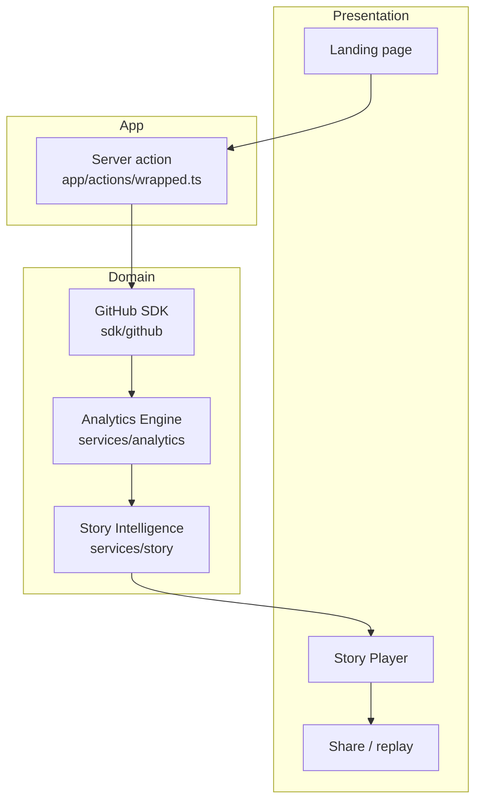
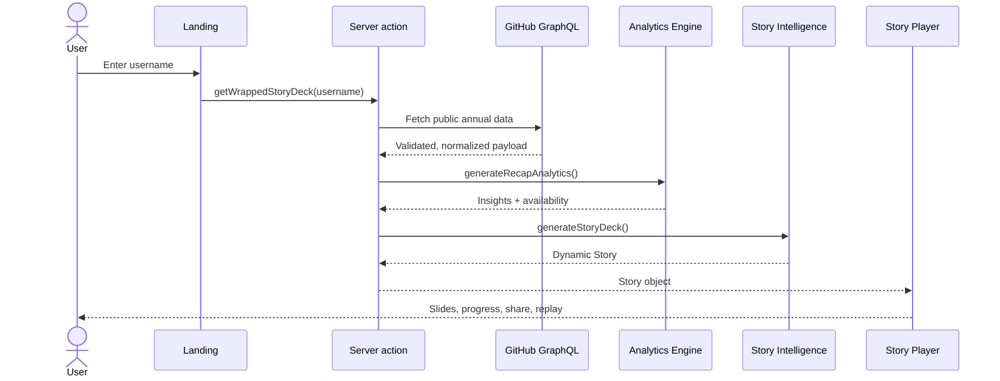
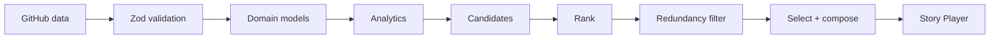

# GitWrapped

**Your year in code, beautifully wrapped.**

GitWrapped turns public GitHub activity into a cinematic annual recap. It is a story, not a dashboard: one slide at a time, evidence-backed, and built to share.

> Every developer has a story. GitWrapped helps tell it.

GitWrapped is an independent open-source project and is not affiliated with GitHub.

---

## What you get

- Enter a GitHub username. No account required.
- A dynamic story assembled from public activity for the current year
- Full-screen Story Player with chapters, keyboard, swipe, and replay
- Shareable recap URL plus a downloadable card (native share or clipboard fallback)
- Unavailable data stays unavailable — no fabricated insights

Try it locally at `/wrapped/octocat` after you start the app.

---

## Architecture

Layers stay separate. The UI never talks to GitHub and never computes analytics.



---

## System design

A recap request is one server-side pipeline. The client only renders the finished story.



---

## Story pipeline

Stories are selected, not hardcoded. Length and chapters change with the evidence.



Supported optional moments include Comeback, Final Push, Contribution Milestones, First Repository, Open Source Chapter, and Commit Message Personality. Weak or missing evidence produces no slide.

---

## Project structure

```
app/            Routes and the wrapped server action
components/     UI primitives, motion, and Story Player
sdk/github/     GraphQL client, schemas, mappers, services
services/
  analytics/    Insights and availability
  story/        Story Intelligence, copy, composition
lib/player/     Navigation, progress, share, errors
domain/models/  Canonical types
docs/           PRD, architecture, design, motion, storyboard
```

| Concern | Lives in |
| --- | --- |
| GitHub integration | `sdk/github/` |
| Analytics | `services/analytics/` |
| Story Intelligence | `services/story/` |
| Story Player | `components/player/`, `lib/player/` |
| Tests | Colocated `*.test.ts` |

---

## Tech stack

Next.js 15 · React 19 · TypeScript · Tailwind CSS v4 · Framer Motion · Zod · GitHub GraphQL · Vitest · Vercel

---

## Getting started

**Requirements:** Node.js 20+ and a GitHub personal access token with `read:user` and public-repo read access.

```bash
git clone https://github.com/isthatpratham/GitWrapped.git
cd GitWrapped
npm install
cp .env.example .env.local
```

Put your token in `.env.local` as `GITHUB_TOKEN`. Never commit that file.

```bash
npm run dev
```

Open [http://localhost:3000](http://localhost:3000), then try `/wrapped/octocat`.

| Script | Purpose |
| --- | --- |
| `npm run dev` | Development server |
| `npm test` | Unit and regression tests |
| `npm run type-check` | TypeScript |
| `npm run build` | Production build |
| `npm start` | Serve the production build |

---

## Design

Dark mode only. Montserrat only. Motion with purpose. Storytelling over charts.

Respect `prefers-reduced-motion`. Do not invent bounce, spin, or decorative loops in the recap.

More detail: [docs/DESIGN_SYSTEM.md](docs/DESIGN_SYSTEM.md), [docs/MOTION_SYSTEM.md](docs/MOTION_SYSTEM.md), [docs/STORYBOARD.md](docs/STORYBOARD.md).

---

## Contributing

Read [CONTRIBUTING.md](CONTRIBUTING.md) before opening a pull request.

---

## License

This project is intended to be released under the MIT License.

Built by Pratham.
